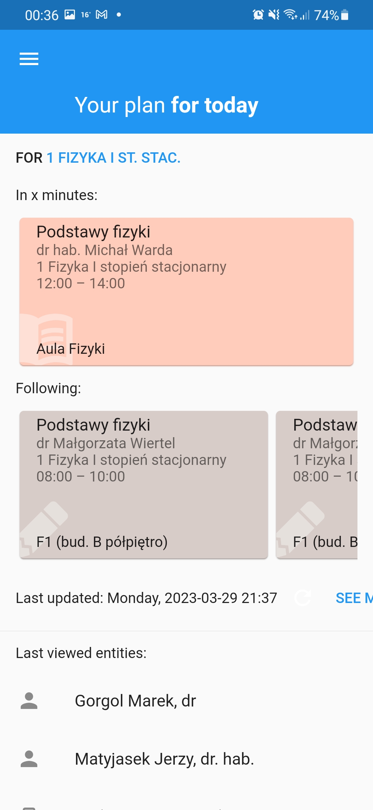
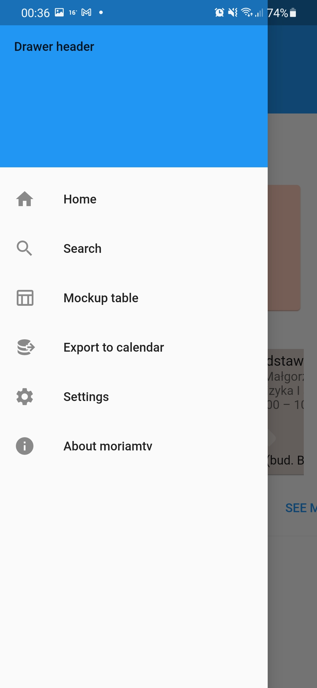
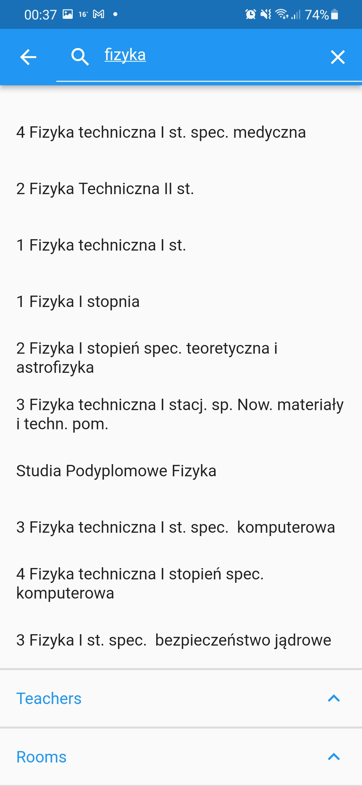
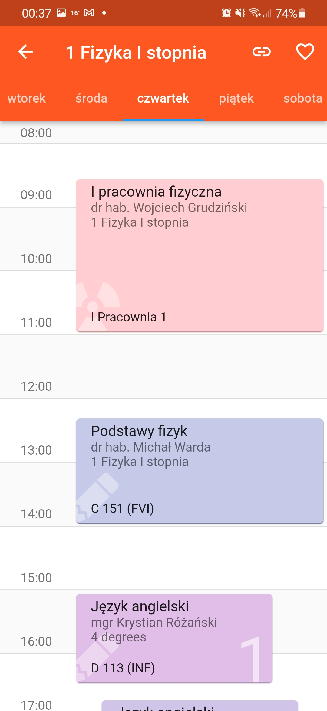
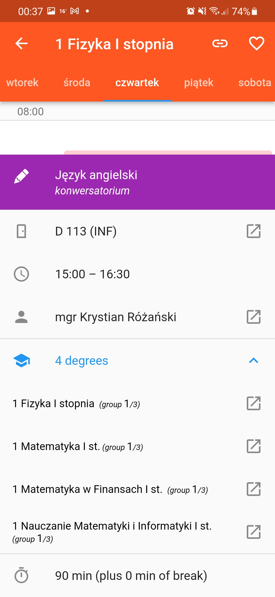

# moriamtv

Mobile client for Moria timetabling system, used by Marie Curie University in Lublin, Poland.

Screenshots from 0.1 build:

## Functionality

Implemented:

* online searching and viewing of timetables
* clickable links between different timetables
* sharing link to a timetable via clipboard

Planned:

* favorities viewed on app drawer
* scroll animation on long entity names
* user interface in multiple languages
* timetable caching
* ability to pick a plan that's being showed on front page
* export to calendar
* tablet view

## Installation

Check „Releases” for alpha build.
